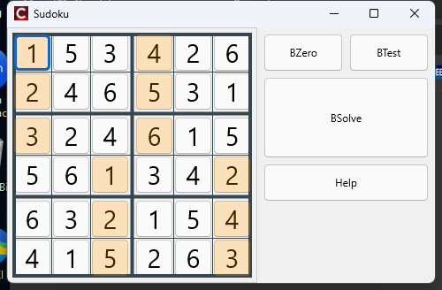

# Sudoku 6 x 6

A small Windows desktop application that plays and solves 6 x 6 sudoku. You
type a problem into the board and it fills in the rest, or it tells you why it
cannot.

It is written in C++ with C++Builder 12 and FireMonkey (FMX).



## The board

A 6 x 6 sudoku holds the numbers 1 to 6. Every number appears once per row,
once per column, and once per block, and the blocks here are **2 rows by 3
columns** rather than the square blocks of the usual 9 x 9 game. That is what
the thick lines on the board separate.

## Using it

One cell is always selected, drawn with a blue border.

| Key | What it does |
| --- | --- |
| Arrow keys | Move the selected cell |
| `1` .. `6` | Give that value to the selected cell, as part of the problem |
| `0` or space | Empty the selected cell again |
| `s` | Solve the board |
| `h` | Show the help |

Clicking a cell selects it; the value still comes from the keyboard. The four
buttons on the right are **BZero** (empty the whole board), **BTest** (load an
example problem), **BSolve** and **Help**.

Colors carry the state of each cell:

- **amber cell, red digit** — a value given by the problem
- **black digit** — a value found by the solver
- **blue border** — the cell currently selected
- **red cell** — a wrong value: the same number already appears in that row,
  column or block

The problem is checked while it is being typed, so a repeated value turns red
straight away and a warning appears under the buttons. The board is only ever
handed to the solver from a position that follows the rules.

## How it works

### The model and the solver

`Info.h` / `Info.cpp` hold the board and know nothing about the interface. A
cell is an index from 0 to 35, and where it sits — its row, its column, the
corner of its block — is worked out from that index by `row()`, `col()`,
`block_row()` and `block_col()` rather than kept in tables that could fall out
of step with the board. The shape of the game is stated once, in `BOARD_SIZE`,
`BLOCK_ROWS` and `BLOCK_COLS`.

The rule itself lives in a single function, `same_group(a, b)`: true when two
cells share a row, a column or a block, and so may not hold the same value.
Everything else asks that one question from one side or the other, which is
why the solver and the error checking can never disagree about what the rules
of the board are.

`solve()` is recursive backtracking over the cells in order. A cell that
belongs to the problem keeps its value and the search moves on; an empty one
tries 1 to 6, keeps the first value that `is_valid()` accepts, and recurses.
When the recursion fails the cell is cleared and the next value is tried, so a
board with no solution is reported rather than left half filled.

`conflict()` and `count_conflicts()` read the same rule back the other way,
while the problem is being written. They compare only the cells given by the
user, because the ones the solver filled in passed `is_valid()` on the way in
and cannot be wrong.

### The interface

`SudokuForm.cpp` builds the board out of 36 `TButton` controls. Two things are
worth knowing about it:

**The geometry is computed, not drawn in the designer.** `layout_board()`
derives every position from a single `CELL_SIZE` constant, leaving a small gap
between two cells of a block and a wider one between blocks. `draw_grid()`
then paints a thin or thick line down the middle of each gap, reading the
geometry back from the cells themselves, and `layout_side()` places the column
of buttons next to the board and fits the form around both. Changing
`CELL_SIZE` moves everything, the window size and the font size of the digits
included.

**Each cell carries a rectangle on top of it.** A styled `TButton` has no
background color of its own, so `mark_v[i]` is a transparent `TRectangle` laid
over the button, and painting the state of a cell means filling that rectangle.
It has `HitTest = false`, so clicks pass through to the button underneath.

No control may take the keyboard focus: the form handles every key itself, and
a focused button would swallow the space bar and click itself.

## Building

From the IDE, open `sudoku.cbproj` and build.

From the command line, `rsvars.bat` puts msbuild and the Embarcadero toolchain
on the path; without it msbuild cannot find the Embarcadero targets:

```bat
call "C:\Program Files (x86)\Embarcadero\Studio\23.0\bin\rsvars.bat"
msbuild sudoku.cbproj /t:Build /p:Config=Debug /p:Platform=Win32
```

The result is `Win32\Debug\sudoku.exe`.

## The files

| File | What it holds |
| --- | --- |
| `sudoku.cbproj` | The C++Builder project |
| `sudoku.cpp` | Entry point, creates the form |
| `SudokuForm.h` / `.cpp` / `.fmx` | The form: layout, grid, colors, keyboard |
| `Info.h` / `Info.cpp` | The board and the solver, no interface code |
| `sudokuPCH1.h` | Precompiled header |
| `app1.mlapp` | An early MATLAB App Designer sketch of the same board, kept for reference. It is not part of the application and nothing in the C++ code uses it. |

The code and the comments are in English.
